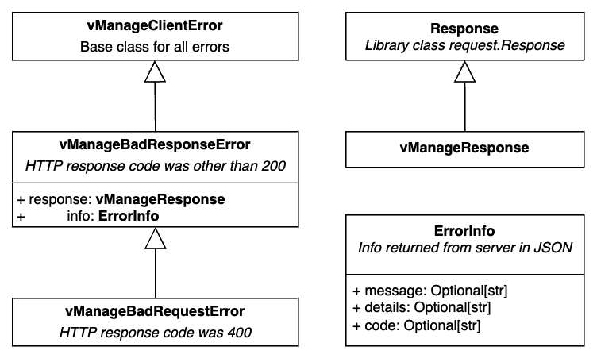

<p align="center">
  <a href="#">
</p>

[](https://www.python.org/)

vManage client is a package for creating simple and parallel automatic requests via official vManage API. It is intended to serve as a multiple session handler (provider, provider as a tenant, tenant). The library is not dependent on environment which is being run in, you just need a connection to any vManage.

## Installation
```console
pip install vmngclient
```

## Session usage example
Our session is an extension to `requests.Session` designed to make it easier to communicate via API calls with vManage. We provide ready to use authenticetion, you have to simply provide the vmanage url, username and password as as if you were doing it through a GUI. 
```python
from vmngclient.session import create_vManageSession

url = "example.com"
username = "admin"
password = "password123"
session = create_vManageSession(url=url, username=username, password=password)

session.get("/dataservice/device")
```

## API usage examples

<details>
    <summary> <b>Get devices</b> <i>(click to expand)</i></summary>

```python
devices = session.api.devices.get()
```

</details>

<details>
    <summary> <b>Admin Tech</b> <i>(click to expand)</i></summary>

```Python
admin_tech_file = session.api.admin_tech.generate("172.16.255.11")
session.api.admin_tech.download(admin_tech_file)
session.api.admin_tech.delete(admin_tech_file)
```
</details>

<details>
    <summary> <b>Speed test</b> <i>(click to expand)</i></summary>

```python
devices = session.api.devices.get()
speedtest = session.api.speedtest.speedtest(devices[0], devices[1])
```

</details>

<details>
    <summary> <b>Upgrade device</b> <i>(click to expand)</i></summary>

```python
# Prepare devices list
vsmarts = session.api.devices.get().filter(personality=Personality.VSMART)
image = "viptela-20.7.2-x86_64.tar.gz"

# Upload image
session.api.repository.upload_image(image)

# Install software

install_task = session.api.software.install(devices=vsmarts, image=image)

# Check action status
install_task.wait_for_completed()
```

</details>

<details>
    <summary> <b>Get alarms</b> <i>(click to expand)</i></summary>
To get all alarms:

```python
alarms = session.api.alarms.get()
```

To get all not viewed alarms:

```python
not_viewed_alarms = session.api.alarms.get().filter(viewed=False)
```

To get all alarms from past `n` hours:

```python
n = 24
alarms_from_n_hours = session.api.alarms.get(from_time=n)
```

To get all critical alarms from past `n` hours:

```python
n = 48
critical_alarms = session.api.alarms.get(from_time=n).filter(severity=Severity.CRITICAL)
```

</details>

<details>
    <summary> <b>Users</b> <i>(click to expand)</i></summary>

```python
# Get all users
session.api.users.get()

# Create user
new_user = User(userName="new_user", password="new_user", group=["netadmin"], description="new user")
session.api.users.create(new_user)

# Update user data
new_user_update = UserUpdateRequest(userName="new_user", group=["netadmin", "netops"], locale="en_US", description="updated-new_user-description", resGroupName="global")
session.api.users.update(new_user_update)

# Update user password
session.api.users.update_password("new_user", "n3W-P4s$w0rd")

# Reset user
session.api.users.reset("new_user")

# Delete user
session.api.users.delete("new_user")

# Get current user authentication type and role
session.api.users.get_auth_type()
session.api.users.get_role()
```

</details>

<details>
    <summary> <b>User Groups</b> <i>(click to expand)</i></summary>

```python
# Get all user groups
session.api.user_groups.get()

# Create user group
group = UserGroup("new_user_group", [])
group.enable_read({"Audit Log", "Alarms"})
group.enable_read_and_write({"Device Inventory"})
session.api.user_groups.create(group)

# Update user group
group.disable({"Alarms"})
session.api.user_groups.update(group)

# Delete user group
session.api.user_groups.delete(group.group_name)
```

</details>

</details>

<details>
    <summary> <b>Sessions</b> <i>(click to expand)</i></summary>

```python
# Get all active sessions
active_sessions = session.api.sessions.get()

# Invalidate sessions for given user
new_user_sessions = active_sessions.filter(raw_username="new_user")
session.api.sessions.invalidate(new_user_sessions)
```

</details>

<details>
    <summary> <b>Resource Groups</b> <i>(click to expand)</i></summary>

```python
# get resource groups
session.api.resource_groups.get()

# create resource group
new_resource_group = ResourceGroup(
    name="new_resource_group",
    desc="Custom Resource Group #1",
    siteIds=[]
)
session.api.resource_groups.create(new_resource_group)

# update resource group
resource_group = session.api.resource_groups.get().filter(name="new_resource_group").single_or_default()
updated_resource_group = ResourceGroupUpdateRequest(
    id=resource_group.id,
    name=resource_group.name,
    desc="Custom Resource Group #1 with updated description and site ids",
    siteIds=[200]
)

# switch to resource group view
session.api.resource_groups.switch("new_resource_group")

# delete resource group
session.api.resource_groups.delete(resource_group.id)
```

</details>

<details>
    <summary> <b>Tenant management</b> <i>(click to expand)</i></summary>

```python
api = session.api.tenant_management
# create tenants
tenants = [
    Tenant(
        name="tenant1",
        orgName="CiscoDevNet",
        subDomain="alpha.bravo.net",
        desc="This is tenant for unit tests",
        edgeConnectorEnable=True,
        edgeConnectorSystemIp="172.16.255.81",
        edgeConnectorTunnelInterfaceName="GigabitEthernet1",
        wanEdgeForecast=1,
    )
]
create_task = api.create(tenants)
create_task.wait_for_completed()
# list all tenants
tenants_data = api.get_all()
# pick tenant from list by name
tenant = tenants_data.filter(name="tenant1").single_or_default()
# get selected tenant id
tenant_id = tenant.tenant_id
# get vsession id of selected tenant
vsessionid = api.vsession_id(tenant_id)
# delete tenant by ids
delete_task = api.delete([tenant_id])
delete_task.wait_for_completed()
# others
api.get_hosting_capacity_on_vsmarts()
api.get_statuses()
api.get_vsmart_mapping()
```
</details>

<details>
    <summary> <b>Tenant migration</b> <i>(click to expand)</i></summary>

```python
from pathlib import Path
from vmngclient.session import create_vManageSession
from vmngclient.model.tenant import TenantExport
from vmngclient.workflows.tenant_migration import migration_workflow

tenant = TenantExport(
    name="mango",
    desc="Mango tenant description",
    org_name="Provider Org-Mango Inc",
    subdomain="mango.fruits.com",
    wan_edge_forecast=100,
    migration_key="MangoTenantMigrationKey",   # only for SDWAN Manager >= 20.13
    is_destination_overlay_mt=True,            # only for SDWAN Manager >= 20.13
)

with create_vManageSession(url="10.0.1.15", username="st-admin", password="") as origin_session, \
     create_vManageSession(url="10.9.0.16", username="mt-provider-admin", password="") as target_session:
    migration_workflow(
        origin_session=origin_session,
        target_session=target_session,
        workdir=Path("workdir"),
        tenant=tenant,
        validator="10.9.12.26"
    )
```

`migration_workflow` performs multi-step migration procedure according to [Migrate Single-Tenant Cisco SD-WAN Overlay to Multitenant Cisco SD-WAN Deployment](https://www.cisco.com/c/en/us/td/docs/routers/sdwan/configuration/system-interface/vedge-20-x/systems-interfaces-book/sdwan-multitenancy.html#concept_sjj_jmm_z4b)


Since 20.13 also MT to ST is supported (just provide suitable origin/target sessions, and `is_destination_overlay_mt` parameter)


Each step of the `migration_workflow` procedure can be executed independently using api methods: `export_tenant`, `download`, `import_tenant`, `store_token`, `migrate_network`

```python
origin_api = origin_session.api.tenant_migration_api
target_api = target_session.api.tenant_migration_api
tenant_file = Path("~/tenant.tar.gz")
token_file = Path("~/tenant-token.txt")
# export
export_task = origin_api.export_tenant(tenant=tenant)
remote_filename = export_task.wait_for_file()
# download
origin_api.download(export_path, remote_filename)
# import
import_task = target_api.import_tenant(export_path, tenant.migration_key)
import_task.wait_for_completed()
# get token
migration_id = import_task.import_info.migration_token_query_params.migration_id
target_api.store_token(migration_id, token_path)
# migrate network
migrate_task = origin_api.migrate_network(token_path)
migrate_task.wait_for_completed()
```
</details>

### Note:
To remove `InsecureRequestWarning`, you can include in your scripts (warning is suppressed when `VMNGCLIENT_DEVEL` environment variable is set):
```Python
import urllib3
urllib3.disable_warnings(urllib3.exceptions.InsecureRequestWarning)
```

## Catching Exceptions
```python
try:
	session.api.users.delete_user("XYZ")
except vManageBadRequestError as error:
	# Process an error.
	logger.error(error.info.details)

# message = 'Delete users request failed' 
# details = 'No user with name XYZ was found' 
# code = 'USER0006'
```



## [Supported API endpoints](https://github.com/CiscoDevNet/vManage-client/blob/main/ENDPOINTS.md)


## [Contributing, bug reporting and feature requests](https://github.com/CiscoDevNet/vManage-client/blob/main/CONTRIBUTING.md)

## Seeking support

You can contact us by submitting [issues](https://github.com/CiscoDevNet/vManage-client/issues), or directly via mail on vmngclient@cisco.com.
